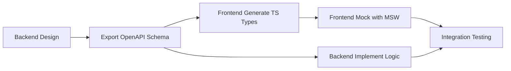

# Detailed Contract-First Protocol

## 1. Rationale
Contract-First development guarantees zero blocking between the frontend and backend tracks. By defining the OpenAPI contract before coding, both teams can work concurrently. The frontend can build fully functional UI against mocks, and the backend can implement logic fulfilling the contract.

## 2. Step-by-Step Flow

### Step A: Backend Design (Stage 2)
1. Backend developer designs the required Pydantic models for the new feature.
2. Example `RequestModel` and `ResponseModel` are created in FastAPI.

### Step B: Schema Export
1. Backend developer runs FastAPI to generate the `openapi.json` file.
2. The schema is copied to the shared `docs/contracts/schemas/` directory.

### Step C: Type Generation
1. Frontend developer pulls the latest schema.
2. Frontend developer runs the type generation command:
   ```bash
   npm run generate-types
   # Which executes: openapi-typescript ../docs/contracts/schemas/openapi.json -o src/api/generated.ts
   ```

### Step D: Mocking (Stage 3)
1. Frontend developer creates MSW handlers in `frontend/mocks/` returning JSON fixtures that satisfy the generated TypeScript types.
2. UI is built and tested against these mocks.

### Step E: Implementation & Integration
1. Backend completes implementation and deploys locally.
2. Frontend switches off MSW and hits the live local backend endpoint to verify integration.

## 3. Contract Change Management

- **Notification:** If the backend must change a contract, they must notify the frontend immediately.
- **Breaking Changes:** Any breaking change (renamed fields, type changes) requires a synchronized update. The backend updates the schema, the frontend regenerates types and fixes resulting compilation errors.
- **No Silent Changes:** The golden rule is that the backend must *never* silently change the shape of an API response without updating the shared contract and notifying the frontend track.

## 4. Integration Testing Protocol
- Both teams must write tests ensuring they conform to the contract.
- Backend uses FastAPI's automatic validation.
- Frontend uses TypeScript's compiler to ensure API client calls match expected types.

## 5. Mermaid Diagram

