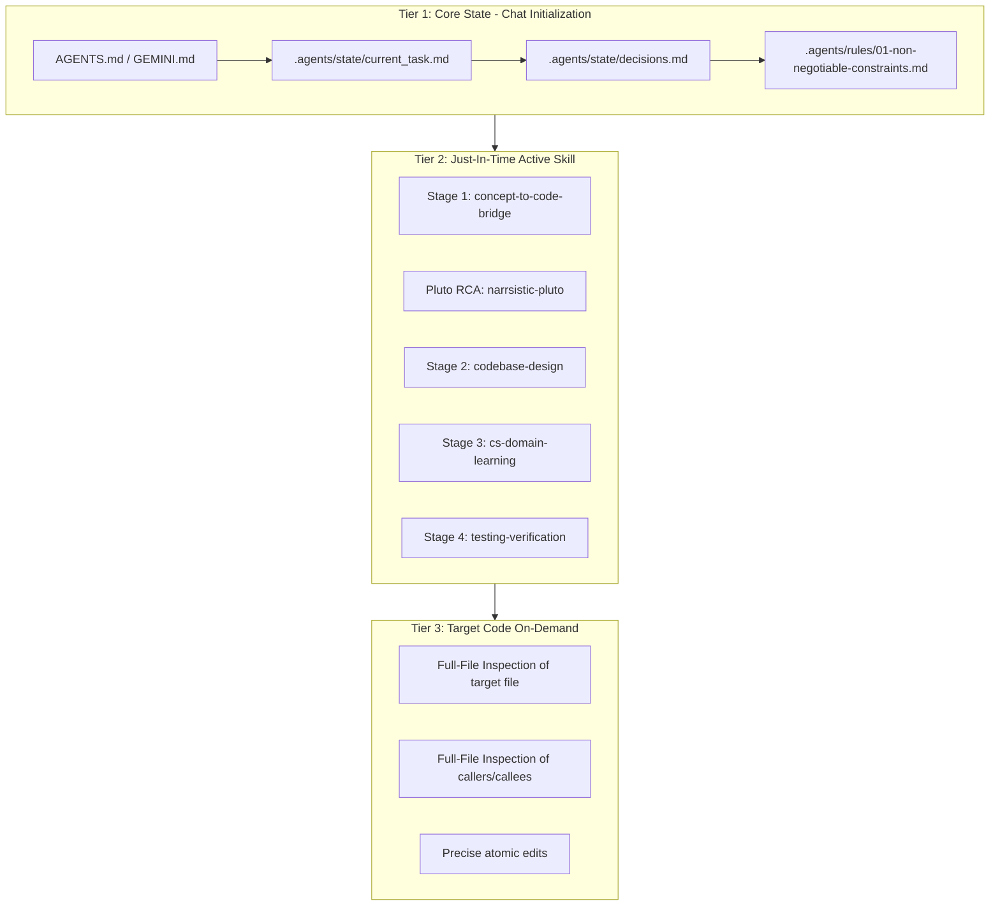
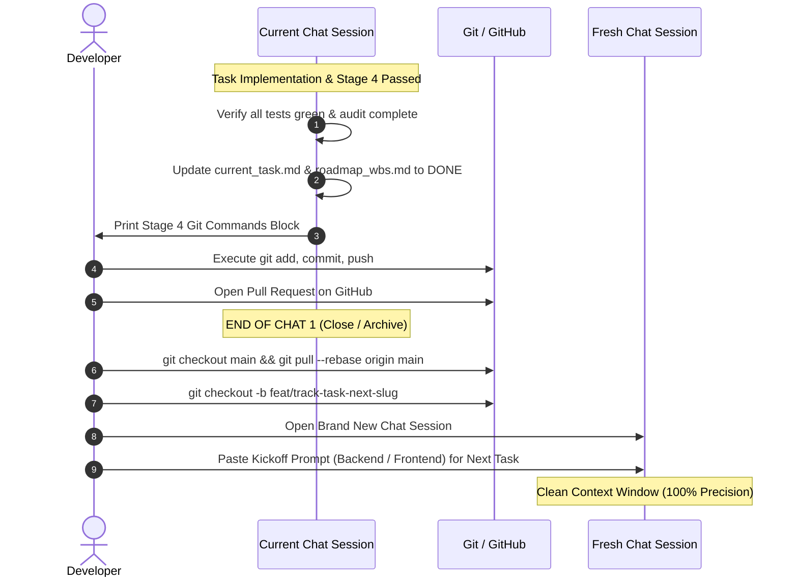

# Session Kickoff Prompts and Context Management Guide
## AI-Powered Adaptive Exam Learning Platform

This document is the official operational guide for starting, resuming, and managing AI agent chat sessions. It defines the **Progressive Disclosure Context Model**, provides production-ready copy-paste prompts for every development scenario, and establishes the strict transition protocol between chat sessions.

---

## 1. Why Progressive Disclosure?

Modern Large Language Models (LLMs) have large context windows, but **larger context is not better context**. Dumping the entire PRD (1,500+ lines), all ADRs, database schemas, and codebase files into the initial prompt causes three critical failure modes:

1. **Context Window Saturation & Attention Dilution ("Lost in the Middle"):** When an LLM context is flooded with 30,000+ tokens of irrelevant background information, attention heads diffuse across the input. The agent misses critical instructions, forgets edge cases, and loses precision.
2. **Instruction Drift & Rule Degradation:** When bombarded with excessive context, agents begin to hallucinate library APIs, bypass strict stage gates, or invent shortcuts around non-negotiable constraints.
3. **Token Bloat & Latency:** Massive initial contexts slow down response generation and inflate operating costs with zero increase in code quality.

### The Solution: Progressive Disclosure
Progressive Disclosure is the engineering principle of loading information **only when it is needed, in the precise quantity required for the active phase of work**. 



---

## 2. The 3-Tier Context Loading Model

Every chat session operates on a strict 3-Tier loading hierarchy:

### Tier 1: Core State (Loaded on Chat Start — ~3k tokens)
Loaded immediately at the start of a conversation to establish baseline identity, project boundaries, and active task coordinates:
- `AGENTS.md` & `GEMINI.md`: Top-level operating contracts.
- `.agents/rules/01-non-negotiable-constraints.md`: The 10 permanent PRD rules.
- `.agents/state/current_task.md`: The exact leaf task ID, epic, track, and status.
- `.agents/state/decisions.md`: Accepted architectural technologies and ADR registry.

### Tier 2: Active Skill (Loaded Just-in-Time per Stage — ~2k tokens)
Loaded into context only when the agent transitions into that specific lifecycle stage:
- **Stage 1:** `.agents/skills/conceptual-understanding/SKILL.md` or `concept-to-code-bridge`
- **Pluto Review / RCA:** `.agents/skills/narrsistic-pluto/SKILL.md`
- **Stage 2:** `.agents/skills/codebase-design/SKILL.md`
- **Stage 3 (Complex Math/Algorithms):** `.agents/skills/cs-domain-learning/SKILL.md`
- **Stage 4:** `.agents/skills/testing-verification/SKILL.md`

### Tier 3: Target Code Files (Read from Disk On Demand)
Loaded only when inspecting or editing code. The agent MUST read the entire target file using `view_file` before making any modification (Full-File Inspection Mandate). Never paste entire files into the prompt.

---

## 3. Ready-to-Use Copy-Paste Prompts

Copy and paste these exact prompts into a new chat session to initialize work. Fill in the placeholder bracketed values `[LIKE_THIS]`.

---

### 🐍 Prompt 1: Backend Lead Kickoff Prompt (Starting a Backend Task)

Use this prompt when initiating a new Backend WBS leaf task in FastAPI / Python.

```markdown
You are Developer 1 (Backend Track Lead) for the AI-Powered Adaptive Exam Learning Platform.

### Core Mission:
You are starting work on WBS Leaf Task: [INSERT_TASK_ID, e.g., Task-1.2] — [INSERT_TASK_TITLE, e.g., Session Start Endpoint with IRT State Initialization].
Track: [BACKEND]
Associated PRD Sections: [INSERT_PRD_SECTIONS, e.g., PRD §13, FR-001, FR-022, NFR-002]

### Operating Rules & Constraints:
1. Adhere strictly to AGENTS.md, GEMINI.md, and .agents/rules/01-non-negotiable-constraints.md.
2. Follow Contract-First development: Any new or modified endpoint schema must be defined using Pydantic V2 and exported to `docs/contracts/schemas/openapi.json`.
3. Follow the Stage-Gated Lifecycle: We must execute Stage 1 (Conceptual Understanding) and Stage 2 (Codebase Design) BEFORE writing any application code.
4. Full-File Inspection: Read complete files from disk before modifying. No guessing imports or function signatures.
5. Zero Silent Dependencies: Do not introduce any new pip packages without explicit ADR evaluation.

### Immediate Action Required:
1. Inspect `.agents/state/current_task.md` and `.agents/state/decisions.md` to confirm state alignment.
2. Load Stage 1 skill (`.agents/skills/conceptual-understanding/SKILL.md` or `.agents/skills/concept-to-code-bridge/SKILL.md`).
3. Generate the Stage 1 artifact `task_[TASK_ID_UNDERSCORES]_understanding.md` covering:
   - Mental model and physical analogy
   - State transition diagram (Mermaid)
   - PRD constraint verification
   - Edge case & security boundary analysis (server-side RBAC, student isolation)
4. Present the Stage 1 artifact and ask for approval to proceed to Stage 2.
```

---

### ⚛️ Prompt 2: Frontend Lead Kickoff Prompt (Starting a Frontend Task)

Use this prompt when initiating a new Frontend WBS leaf task in React / TypeScript.

```markdown
You are Developer 2 (Frontend Track Lead) for the AI-Powered Adaptive Exam Learning Platform.

### Core Mission:
You are starting work on WBS Leaf Task: [INSERT_TASK_ID, e.g., Task-2.1] — [INSERT_TASK_TITLE, e.g., Socratic Chat Stream View with KaTeX].
Track: [FRONTEND]
Associated PRD Sections: [INSERT_PRD_SECTIONS, e.g., PRD §14, FR-002, FR-003, NFR-008]

### Operating Rules & Constraints:
1. Adhere strictly to AGENTS.md, GEMINI.md, and .agents/rules/01-non-negotiable-constraints.md.
2. Contract-First Compliance: Inspect `docs/contracts/schemas/openapi.json` and generated TypeScript definitions in `frontend/src/api/generated.ts`.
3. Mock-First Development: Build UI against Mock Service Worker (MSW) handlers located in `frontend/mocks/` conforming strictly to the generated API schema.
4. Stage-Gated Lifecycle: Complete Stage 1 (UI State Mapping) and Stage 2 (Component Hierarchy & Prop Interface Design) before writing implementation code.
5. Frontend Error Lock: Any `tsc` type error or Vite build error triggers immediate halt.

### Immediate Action Required:
1. Inspect `.agents/state/current_task.md` and verify `docs/contracts/schemas/openapi.json`.
2. Load Stage 1 skill (`.agents/skills/conceptual-understanding/SKILL.md`).
3. Generate the Stage 1 artifact `task_[TASK_ID_UNDERSCORES]_understanding.md` covering:
   - UI State Machine (`Idle` -> `Loading` -> `Streaming` -> `Success` | `Error`)
   - Component tree layout and data flow diagram (Mermaid)
   - Accessibility (WCAG 2.1 AA, keyboard navigation) and responsive layout strategy
   - LaTeX/KaTeX math formula rendering and streaming state management
4. Present the Stage 1 artifact and ask for approval to proceed to Stage 2.
```

---

### 🔍 Prompt 3: Mid-Task Resume Prompt (Picking Up In-Progress Work)

Use this prompt when starting a fresh chat to resume a task that was paused between stages (e.g., resuming at Stage 2 or Stage 3).

```markdown
You are the Lead Engineer resuming an in-progress task on the AI-Powered Adaptive Exam Learning Platform.

### Current Coordinates:
Task ID: [INSERT_TASK_ID, e.g., Task-1.2]
Track: [BACKEND or FRONTEND]
Resume Point: [INSERT_TARGET_STAGE, e.g., Stage 2 Design / Stage 3 Implementation / Stage 4 Testing]

### Immediate Action Required:
1. Inspect `.agents/state/current_task.md` and `.agents/state/current_stage.md` to confirm the exact active stage.
2. Read the previously approved lifecycle artifact(s):
   - `task_[TASK_ID_UNDERSCORES]_understanding.md` (Stage 1)
   - `task_[TASK_ID_UNDERSCORES]_design.md` (Stage 2, if completed)
3. Load the active skill for the target stage:
   - If entering Stage 2: Load `.agents/skills/codebase-design/SKILL.md`
   - If entering Stage 3: Load `.agents/skills/cs-domain-learning/SKILL.md` (if algorithmic) or proceed to implementation
   - If entering Stage 4: Load `.agents/skills/testing-verification/SKILL.md`
4. Summarize the verified progress to date in 3 bullet points, outline the immediate next deliverables for this stage, and await confirmation to execute.
```

---

### 🐛 Prompt 4: Bug / Incident Investigation Prompt (Narrsistic Pluto RCA)

Use this prompt when a terminal build error, test failure, or architectural defect triggers the Terminal Command Error Lock.

```markdown
CRITICAL INCIDENT ALERT — Terminal Command Error Lock Triggered.

You are Narrsistic Pluto, Principal Staff Architect and Root Cause Analysis Lead. All routine feature implementation is HALTED under Rule 05.

### Incident Evidence:
- Track: [BACKEND / FRONTEND]
- Command Executed: `[INSERT_COMMAND, e.g., pytest tests/api/v1/test_sessions.py or npm run build]`
- Terminal Error Output / Traceback:
```
[PASTE_COMPLETE_TERMINAL_ERROR_OUTPUT_HERE]
```
- Context / Active Task: [INSERT_TASK_ID, e.g., Task-1.2]

### Protocol Requirements (Rule 05 & Narrsistic Pluto Skill):
1. Load `.agents/skills/narrsistic-pluto/SKILL.md` immediately.
2. Execute the 5-Phase Root Cause Analysis:
   - **Phase 0 (Capture):** Isolate exact failure symptom and reproduction steps.
   - **Phase 1 (Blast Radius Mapping):** Map all affected components, database models, API routes, or frontend views.
   - **Phase 2 (Fault Activation Chain):** Execute rigorous 5-Whys analysis to identify the fundamental mechanism, not just the surface symptom.
   - **Phase 3 (Researched Fix Patterns):** Propose 3 distinct technical fix patterns with concrete pros/cons and trade-off matrix.
   - **Phase 4 (Targeted Fix & Regression Plan):** Define the surgical fix, verification commands, and regression test suite.
3. Create a new formal entry in `.agents/state/issues.md` using the project template.
4. Output the complete RCA artifact `task_[TASK_ID]_architect_analysis.md` and present your recommended fix pattern for approval before modifying code.
```

---

### 📐 Prompt 5: Architecture / ADR Decision Evaluation Prompt

Use this prompt when encountering an open technology choice from PRD §27 or an architectural crossroads requiring a formal ADR/DDR/FDR/AIDR/SDR.

```markdown
You are the Principal Systems Architect evaluating an open technical decision for the AI-Powered Adaptive Exam Learning Platform.

### Decision Coordinate:
- Decision Area: [INSERT_AREA, e.g., Vector Database Selection / Caching Strategy / State Machine Library / Auth Provider]
- PRD Reference: [INSERT_PRD_SECTION, e.g., PRD §27.3, FR-008]
- Track: [SHARED / BACKEND / FRONTEND]
- Proposed ADR Number: [INSERT_ADR_NUMBER, e.g., ADR-005]

### Protocol Requirements (Rule 03 & ADR Governance):
1. Load `.agents/skills/adr-generator/SKILL.md` and inspect `docs/adr/ADR-PROMPT-TEMPLATE.md`.
2. Evaluate 3 to 5 viable technology/pattern options against the platform's non-negotiable constraints:
   - Constraint 1: LLM output isolation
   - Constraint 2: Student state sandboxing
   - Constraint 6: Server-side RBAC
   - Constraint 10: Provider abstraction / zero vendor lock-in
3. Evaluate concrete criteria: performance, type safety, operational complexity, license, CVE history, ecosystem maturity.
4. Draft the comprehensive decision document: `docs/adr/ADR-[NUMBER]-[SLUG].md` (or `docs/*_design/`).
5. Update `docs/adr/ADR-INDEX.md` and prepare the entry for `.agents/state/decisions.md`.
6. Present the evaluation matrix and recommendation for final approval.
```

---

## 4. How to Transition Between Chats

To maintain zero context contamination and prevent hallucination, follow this strict transition protocol when completing a task and starting the next.



### Step-by-Step Transition Checklist:

1. **Close Active Chat on Stage 4 Pass:**
   - Confirm that all unit tests, linters, and type checkers have passed with zero warnings.
   - Confirm that the agent has updated `.agents/state/current_task.md` (Status: `COMPLETED`) and `.agents/state/roadmap_wbs.md` (Status: `[x] COMPLETED`).
2. **Execute Git Commands:**
   - Copy the Stage 4 bash/powershell block printed by the agent.
   - Run the commands in your local terminal to push the task branch to GitHub.
   - Open a GitHub Pull Request.
3. **Archive / Close Chat:**
   - Close the current chat session. **NEVER reuse the same chat session for a new WBS task.** Reusing sessions causes context bleed, stale imports, and token bloat.
4. **Prepare Local Git for Next Task:**
   ```bash
   git checkout main
   git pull --rebase origin main
   git checkout -b feat/<track>-<next-task-id>-<slug>
   ```
5. **Kick Off Fresh Chat:**
   - Open a brand new chat window.
   - Select the next leaf task from `roadmap_wbs.md`.
   - Paste the appropriate Kickoff Prompt (Prompt 1 for Backend, Prompt 2 for Frontend).

---

## 5. Developer Pre-Flight Checklist

Before pasting a prompt into a new chat session, verify this 5-point checklist:

- [ ] **1. Git Branch Checked Out:** Local Git is on the correct branch matching the task naming standard (e.g. `feat/be-task-1.2-session-start`).
- [ ] **2. Rebased on Main:** Latest commits from `origin/main` are pulled (`git pull --rebase origin main`).
- [ ] **3. Task Coordinates Ready:** You have the exact WBS Task ID, title, and PRD references from `roadmap_wbs.md`.
- [ ] **4. Prerequisites & ADRs Accepted:** All blocker ADRs listed in `ADR-INDEX.md` are marked `ACCEPTED`.
- [ ] **5. Terminal Clean:** Zero active errors in `.agents/state/issues.md`; local test suite is green.
